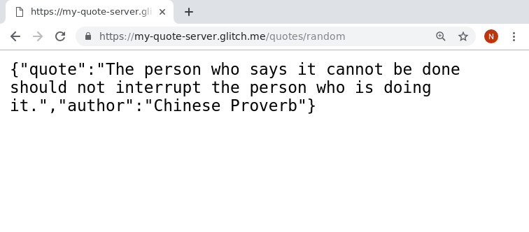
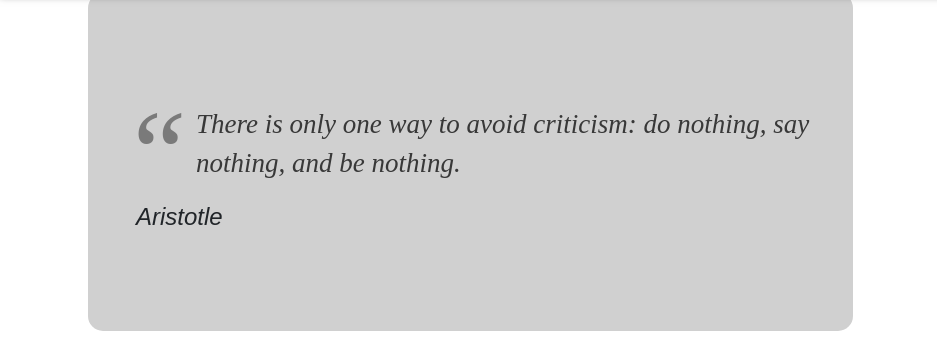

# Challenge: A Quote Server

## How long will this take?

- 1 hour (level 1)
- 3-4 hours (advanced level)

## Overview: what is this challenge?

In this challenge you must make a server (using Node and Express) which serves quotes, in JSON form.

In the _extended_ work of this challenge, you also make a React app which displays the quotes retrieved from your new server.

Here's how it might look if you make a request to such a server.


## Getting Started

Fork this repository and read this file. This document outlines all of this tasks to complete this weeks homework.

## Want to run your code on the internet?

If you want to share your server with other people the easiest way to do this is to use Glitch

- Remix [this server on glitch -
  https://glitch.com/~cyf-quotes-start](https://glitch.com/~cyf-quotes-start)
- Name your new server `yourname-quote-server`
- Make sure you're logged in so that it saves
- Check that it is working by making a request to `/`
- Take time to read the comments
- Copy the code you've written to Glitch

## Level 1 Challenge - make the quote server

Your server must have at least these two "routes":

- `/quotes` - returns ALL of the quotes, as JSON.
- `/quotes/random` - returns ONE of the quotes, picked differently at random each time it is requested.

A list of quotes (in JSON format) is provided in this repo [quotes.json](./quotes.json), but it will also be included in the starter project on glitch. Each quote is a simple object with a quote and an author.

Try to use what you know to do this challenge on your own. However, there are some steps to guide you, below.

## Add a `/quotes` route

Add a `/quotes` route to return _all_ of the quotes as JSON.

Note that the quotes have already been loaded for you from a JSON file.

Test that your server successfully serves all of the quotes as json by making a request for /quotes from your new server.

### Help - how do I add a route?

To add a new route, you can copy-paste an existing route and change its parameters.

For example, here are two (very boring) routes

```
app.get('/one', function(request, response) {
  response.send("You asked for route /one")
});

app.get('/two', function(request, response) {
  response.send("You asked for route /two")
});
```

You can refer to this short [Basic Routing](https://expressjs.com/en/starter/basic-routing.html) document for discussion on what each part does.

## Add a `/quotes/random` route

Add a `/quotes/random` route to return _ONE_ of the quotes, picked randomly on each request.

The JavaScript to pick randomly from an array is actually quite difficult, so we've provided a function to help you, called `pickFromArray`.

If you want a tougher JS challenge, feel free to write your own function which returns one element at random from any given array, and use that!

Test that this route is working too by making a request to `/quotes/random` You should get one quote - an object with a quote and an author.

Be sure to check that the previous routes `/quotes` and `/` are still working, too!

## End of Level 1 challenge!

Well done!

- On Slack, post the address of your server.
- Also post the address when you mark your google classroom assignment done.
- You might want to download your project for safekeeping. (Tools: Git, Import, and Export: Download Project)
- Read the following ideas for further work

## Level 2 Challenge - allow quote _searches_!

### Overview

In this level of the challenge you will allow the user of your quotes API to _search_ your list of quotes.

It should work with requests like this one:

- `/quotes/search?term=life`
- `/quotes/search?term=success`
- `/quotes/search?term=miss`

Extra (bonus) requirements:

- bonus: make your search case-insensitive
- bonus: make the search return matches on quote OR author text.

### Go ahead!

If you think you know how to do that, go ahead!

### In more detail

#### Algorithm

1. receive a search term (a string) to look for
2. then find any quotes that contain that string in their quote text
3. then return only those matching quotes

As with `/quotes`, your new route should return a JSON array of quotes. If you find none that match, it should return an empty array, `[]`.

#### Getting parameter(s) from the URL

We have to learn how to get the search term from the user. This is very easy to program, but you should read on to understand what is going on.

Users of the API will add their search term to their URL with a _query parameter_ called `term`.

So, for example, if the user wanted to search for quotes about life, their HTTP request might have this target: `/quotes/search?term=life`

You should [read about the query string part of the URL, here](https://developer.mozilla.org/en-US/docs/Web/HTTP/Basics_of_HTTP/Identifying_resources_on_the_Web).

#### So, how do I get these query parameters when using Express?

Look at [the code of this example glitch](https://glitch.com/~cyf-query-params).

Then use it by clicking these links and then changing the search word.

- https://cyf-query-params.glitch.me/search?word=Mussie
- https://cyf-query-params.glitch.me/search?word=holiday

In express, we use the object `req.query`, which will have all the parameters passed to us in the URL's query string. [The official documentation is here](https://expressjs.com/en/api.html#req.query).

#### An intermediate step - echo the parameter

Once you think you understand the above you might want to make a simple test route that takes a query parameter and just repeats the word back to the user.

e.g. `/echo?word=ismail` should just return `You said 'ismail'`

then _finally_ you'll be ready to use this variable in searching through your quotes!

### Searching for quotes - a pure JS exercise

Once you know which word you are searching for, the next task is really a pure javascript task.

Searching through your list of quotes to find ones whose text includes that word... this is done no differently in Express or Node than in pure javascript.

So I suggest you first get it working in pure javascript. That will give you less to think about.

[Here is an example pure-javascript project for developing this part of your code](https://repl.it/@enz0/findMatchingQuotes). But you could do the same in your local development environment.

Once you've got that working, you can copy-paste your function into your Express app and use it.

## End of Level 2 challenge!

Well done!

- Mark the relevant Google Classroom assignment done, but _before you do_, add your two links (1 for the glitch project and 1 for your server address) as _link attachments_ to the assignment. (Instructions on this are in the assignment)

- Also post the two links (as one message) [in THIS thread on Slack](https://codeyourfuture.slack.com/archives/CEDK6JPKQ/p1557924290017700).

### Ideas for further work

- Use YOUR favourite quotes

- Use the same code to serve something other than quotes - maybe revision notes, proverbs, or other data that you want to be reminded about.

## Challenge: Intermediate: Use a library to make random picking easier

In the real world, many developers would use a library like [lodash](https://lodash.com/) to make it simpler to do tasks like picking randomly from an array.

In this extra challenge, you should install and use lodash to do the picking.

[Here's the documentation for its sample() function](https://lodash.com/docs/4.17.11#sample).

Install the lodash library:

- edit the file `package.json`...
- add a line for lodash in the dependencies (you'll already see one for "express").
- You can use "\*" as the version number for now.
- Glitch will automatically install it.

Add a "require" line in your server.js so that you can use the library.

`const lodash = require('lodash');`

then you can use...

`lodash.sample(myArray)`

This is the same process for almost ANY library you can find on [https://www.npmjs.com/](npm).

## Challenge: Advanced: Add a React app as a front-end

Note: only do this if you have done all other Node homework this week - that is the priority.

- Make a very simple React app called quotes-react-app
- Have it fetch a random quote from your server on glitch. You'll have to enable CORS on the express app. See below.
- (Bonus: Allow the user to get a new random quote from the server, by clicking a button or clicking the quote.)
- Host your react app on netlify
- Post the URL to your hosted React app on Slack, and in your google classroom submission (along with your glitch server url)

### Example screenshot of Simple React app

Here's an example of how your react app might look.
Note I didn't add a "get new quote" button here.


#### Enabling CORS on the Express app

You'll have to install and enable CORS in order to allow your JSON to be loaded from a different server (glitch.me) than your React app was initially loaded (probably netlify.com).

in `package.json` add a dependency for `"cors": "^2.8.5"`

Then in your `server.js` add...

`var cors = require('cors')`

and

`app.use(cors())`

Read more or CORS [here](https://codeyourfuture.github.io/syllabus-master/others/cors.html)
and in CORS in Express [here](https://expressjs.com/en/resources/middleware/cors.html).

### Credits

I found the quotes list here https://gist.githubusercontent.com/nasrulhazim/54b659e43b1035215cd0ba1d4577ee80/raw/e3c6895ce42069f0ee7e991229064f167fe8ccdc/quotes.json
